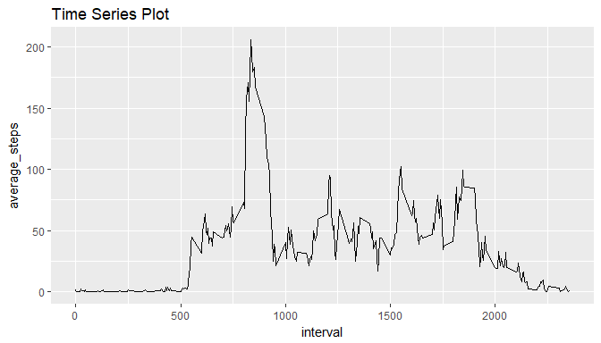

## Loading and preprocessing the data

### Loading the data

#### 1. Downloading and extracting the data


```r
download.file("https://d396qusza40orc.cloudfront.net/repdata%2Fdata%2Factivity.zip",
              destfile = "./activity.zip")
unzip("./activity.zip")
```

#### 2. Loading the libraries

```r
library(dplyr)
library(ggplot2)
library(lubridate)
library(data.table)
library(xtable)
```

#### 3. Loading the data file


```r
activity_data <- fread("./activity.csv",sep = ",")
```

### Preprocessing of the data

#### 1. Summary of the data

**The structure of the data is :**

```r
str(activity_data)
```

```
## Classes 'data.table' and 'data.frame':	17568 obs. of  3 variables:
##  $ steps   : int  NA NA NA NA NA NA NA NA NA NA ...
##  $ date    : chr  "2012-10-01" "2012-10-01" "2012-10-01" "2012-10-01" ...
##  $ interval: int  0 5 10 15 20 25 30 35 40 45 ...
##  - attr(*, ".internal.selfref")=<externalptr>
```

**Summary of the data is:**


```r
summary(activity_data)
```

```
##      steps            date              interval     
##  Min.   :  0.00   Length:17568       Min.   :   0.0  
##  1st Qu.:  0.00   Class :character   1st Qu.: 588.8  
##  Median :  0.00   Mode  :character   Median :1177.5  
##  Mean   : 37.38                      Mean   :1177.5  
##  3rd Qu.: 12.00                      3rd Qu.:1766.2  
##  Max.   :806.00                      Max.   :2355.0  
##  NA's   :2304
```

#### 2. Converting the data to the suitable format

Converting the feature "date" from class "character" to "Date"


```r
activity_data<-mutate(activity_data,date=ymd(date))
str(activity_data)
```

```
## 'data.frame':	17568 obs. of  3 variables:
##  $ steps   : int  NA NA NA NA NA NA NA NA NA NA ...
##  $ date    : Date, format: "2012-10-01" "2012-10-01" ...
##  $ interval: int  0 5 10 15 20 25 30 35 40 45 ...
```

--------------------------------------------------------------------------------

## What is mean total number of steps taken per day?

### 1. Calculating total number of steps

To calculate the steps per day the data was grouped by date and sum of the steps
was calculated per day.


```r
steps_perday <- na.omit(activity_data) %>% select(steps,date) %>% group_by(date)%>% 
                summarise(total_steps=sum(steps))
head(steps_perday)
```

```
## # A tibble: 6 x 2
##   date       total_steps
##   <date>           <int>
## 1 2012-10-02         126
## 2 2012-10-03       11352
## 3 2012-10-04       12116
## 4 2012-10-05       13294
## 5 2012-10-06       15420
## 6 2012-10-07       11015
```

### 2. Histogram of total number of steps


```r
g1 <- ggplot(data=steps_perday,aes(total_steps))
g1 + geom_histogram(fill="lightgreen",bins=10)+
  labs(title="Histogram of total number of steps")
```

<!-- -->

### 3. Mean and median of total number of steps taken per day


```r
mean_steps <- as.character(mean(steps_perday$total_steps))
median_steps <- as.character(median(steps_perday$total_steps))
```

Mean and median of total number of steps taken per day are ```10766.1886792453``` 
and ```10765``` respectively.   

--------------------------------------------------------------------------------

## What is the average daily activity pattern?

### 1. Time Series Plot

In order to create time series plot, the data was grouped by interval and then
average of the steps in each interval was computed.


```r
five_inter_avg <- activity_data %>% select(steps,interval) %>% group_by(interval) %>%
                  summarise(average_steps = mean(steps,na.rm = TRUE))
```

Creating the time series plot


```r
g2 <- ggplot(data = five_inter_avg,aes(interval,average_steps))
g2 + geom_line() +labs(title="Time Series Plot")
```

<!-- -->

### 2. 5-minute interval containing maximum number of average steps


```r
max_steps_interval <- five_inter_avg %>% filter(average_steps==max(five_inter_avg$average_steps))
```

Interval ```835``` contains the maximum number of average 
steps i.e.  ```206.1698113```.

-------------------------------------------------------------------------------

## Imputing missing values

### 1. Total Number of missing values


```r
missing_values <- sum(is.na(activity_data))
```

Total number of missing values is ```2304```.   

### 2. Strategy for filling missing values

For filling the missing values mean for the 5-minute interval is used. This 
strategy was used because the mean/median for that day can also give NA as some
day has all NA values.

### 3. New Data set

The following code iterates over the number of rows in the data and checks if the
data has 'NA' value or not if there is an 'NA' value then the value is replaced by 
mean for the 5-minute interval.


```r
new_data <- activity_data
for(i in 1:nrow(new_data)){
  new_data[i,]$steps <- ifelse(is.na(new_data[i,]$steps),
                                    five_inter_avg[(five_inter_avg$interval==new_data[i,]$interval),]$average_steps,
                               new_data[i,]$steps)
}
```

### 4. Histogram , mean and median of the new data

**Histogram**


```r
steps_perday_new <- new_data %>% select(steps,date) %>% group_by(date)%>% 
                summarise(total_steps=sum(steps))
g3 <- ggplot(data=steps_perday_new,aes(total_steps))
g3 + geom_histogram(fill="blue",bins = 10)+labs(title="Histogram of new data")
```

<!-- -->

***Mean and Median***

```r
mean_steps_new <- as.character(mean(steps_perday_new$total_steps))
median_steps_new <- as.character(median(steps_perday_new$total_steps))
```

Mean and median of total number of steps taken per day for new data are 
```10766.1886792453``` and ```10766.1886792453``` respectively.   

***Analysis***   
The mean of the data after modification remains the same while the median becomes
equal to mean. After imputing the missing values we see a peak at the mean of 
the data i.e. count for mean value is the largest in the histogram.

## Are there differences in activity patterns between weekdays and weekends?

### 1. Factor variable


```r
new_data$day <- weekdays(new_data$date)
new_data$day_type <- ifelse(new_data$day%in%c("Saturday","Sunday"),"weekend","weekday")
new_data$day_type <- factor(new_data$day_type)
```

### 2. Plot

```r
average_new_data <- new_data %>% select(steps,interval,day_type) %>% 
                    group_by(day_type,interval) %>% summarise(avg_steps=mean(steps)) 

g4 <- ggplot(average_new_data,aes(interval,avg_steps))
g4 + facet_grid(day_type~.)+geom_line()
```

<!-- -->

It can be seen that activity starts earlier in weekdays and value of avg_steps is also higher in weedays.
